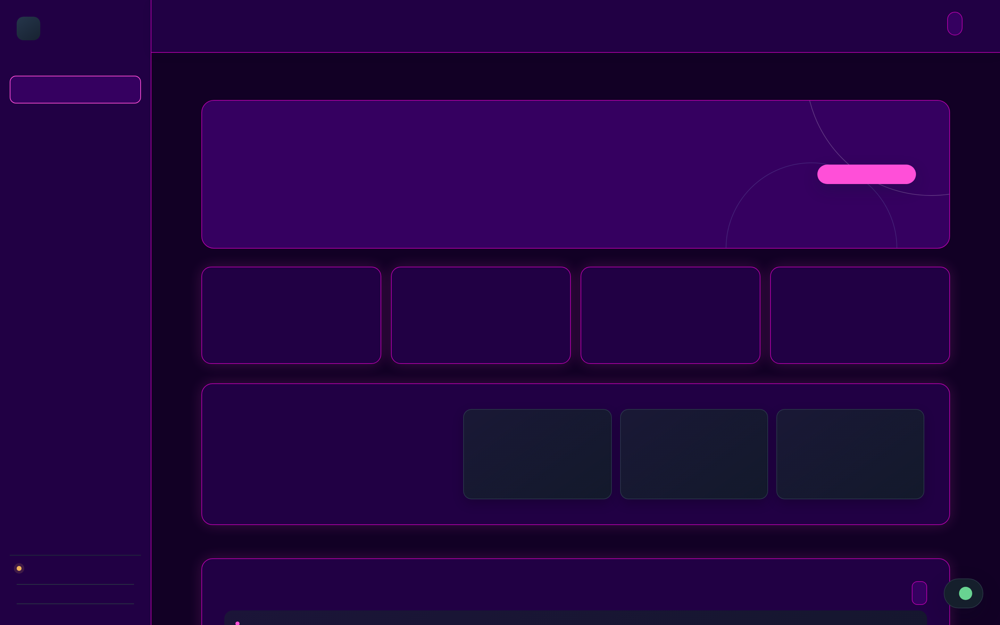
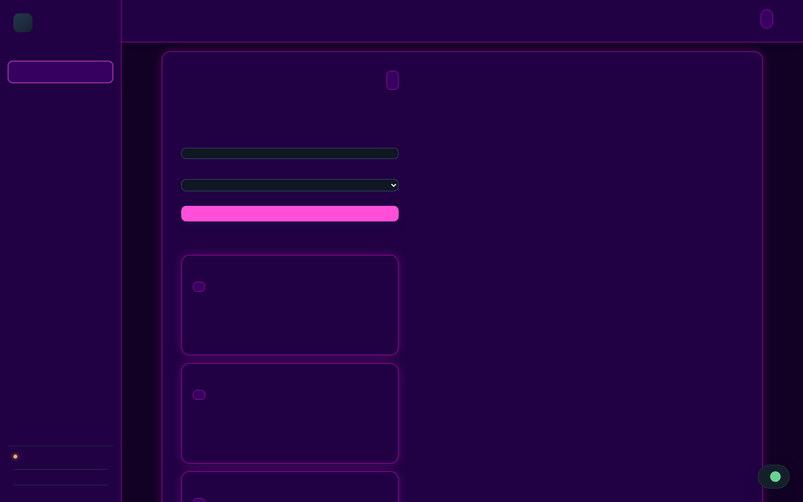
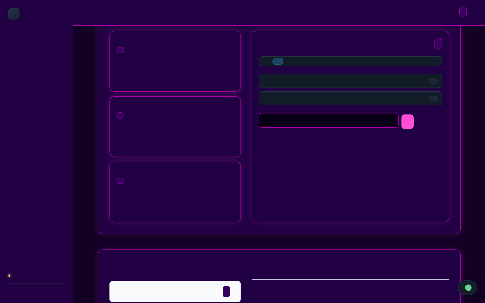
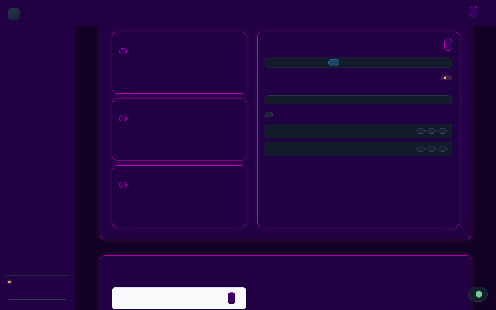
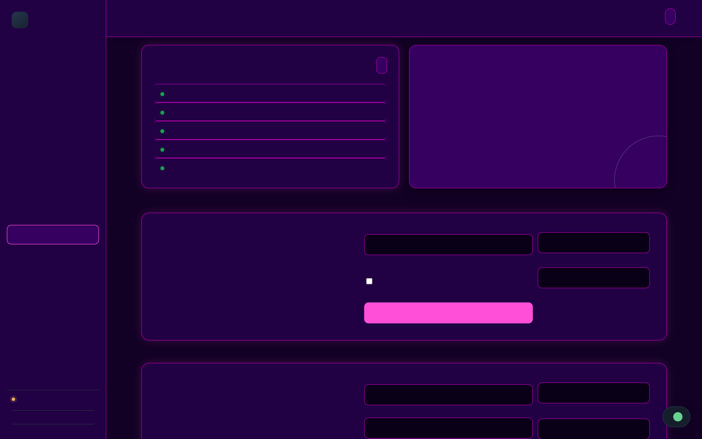
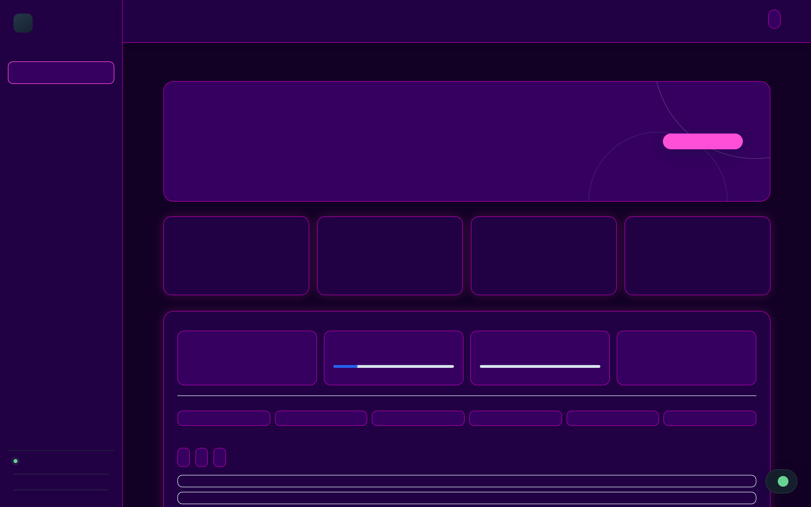
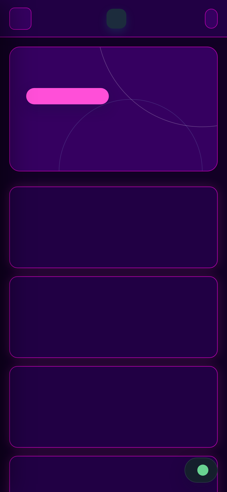
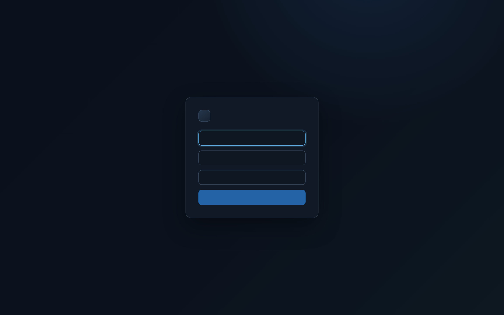

# Screenshots

These are screenshots of the real StePanel UI, not mockups. They are captured
from a running control plane with synthetic data by
[`scripts/capture-screenshots.sh`](../scripts/capture-screenshots.sh), which
records the commit, version, browser, and capture time in
[`assets/screenshots/metadata.txt`](assets/screenshots/metadata.txt).
The preview set uses the Retro 80s Neon appearance pack.

## Operator overview



The administrator's starting point: managed sites, connected domains, backup
freshness, and platform checks that need review. "Control plane needs
attention" is real: the demo runs on a development host, so production checks
such as filesystem quotas and TLS do not pass.

## Managed sites



Create a site from a template and see each site's domains, applications,
databases, and latest backup.

## Site workspace



Each site has its own workspace with tabs for domains, runtime, deployments,
databases, backups, logs, workers, tasks, security, and settings.

## Backups and recovery status



Recovery status reports what has been proven, not just what exists. Here the
backups are signed and verified, but no restore rehearsal has passed yet, so
the site is marked **Unverified**.

## Activity and jobs



Site creation, backups, restores, and imports run as durable jobs with
recorded state.

## Customer workspace



A customer account signs in with a password and TOTP code and sees only its
assigned sites, plan, and usage. Infrastructure, security, database, migration,
and account administration controls are absent, and the API enforces the same
scope. See [SHARED_HOSTING.md](SHARED_HOSTING.md) for what the customer
workspace supports.

## Mobile and sign-in

<table>
<tr>
<td width="40%"></td>
<td width="60%"></td>
</tr>
</table>

## How the screenshots are made

```sh
npm ci
npx playwright install chromium   # or set PLAYWRIGHT_CHANNEL=chrome
scripts/capture-screenshots.sh    # writes docs/assets/screenshots
```

The script builds StePanel, starts a disposable control plane with throwaway
secrets, and seeds it through the same API the dashboard uses: three sites,
four domains on the reserved `.example` TLD, three backups, and one customer
account. Everything on screen is server state. Because the demo host has no
root broker, the root helpers are replaced by stand-ins. The vhost helper only
writes the route file StePanel reads back, and the application and site
isolation helpers do nothing, so no web server, Unix account, or cgroup is
changed.

Regenerate the screenshots when the UI changes and before each release. For a
release review, also follow the [live screenshot checklist](LIVE_SCREENSHOTS.md)
on a disposable installation of the tagged build.
